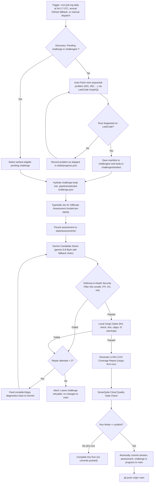
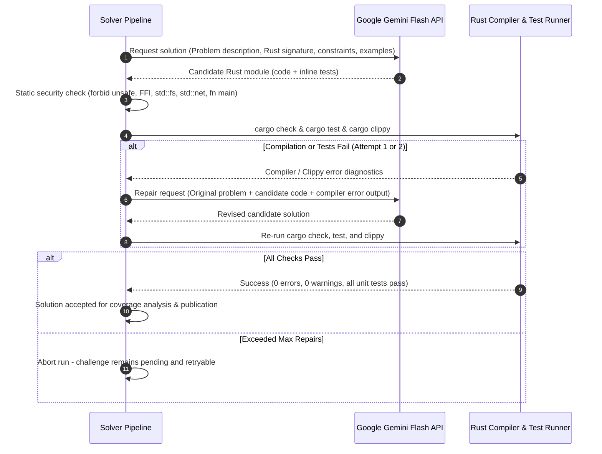

# Autonomous Rust LeetCode Solver Pipeline

An autonomous, guarded pipeline that sequentially discovers LeetCode problems, confirms Rust support, assesses problem difficulty using TypeSafe Jev AI, synthesizes candidate solutions using Google Gemini Flash models with a bounded self-repair compiler loop, verifies code coverage, and publishes verified solutions directly to `main`.

[](https://github.com/marcelomiyake/autonomous-rust-leetcode-solver-pipeline/actions/workflows/build.yml)
[](https://sonarcloud.io/summary/new_code?id=marcelomiyake_autonomous-rust-leetcode-solver-pipeline)

---

## Architecture & Workflow

The pipeline is dispatched by cron-job.org daily at 04:17 UTC (01:17 in São Paulo) through GitHub `workflow_dispatch`. A yearly GitHub schedule remains as a fallback, and maintainers can trigger runs manually. The workflow handles everything from problem discovery to atomic repository updates without manual intervention.

The repository currently contains authorized challenges and Rust solutions for problems 001–009. `state/progress.json` records the published sequence; consult it and the module registry for the current state as the pipeline advances.



---

## Bounded Self-Repair Loop

When Gemini produces code that fails syntax checks, type checking, unit tests, or Clippy lints, the pipeline does not immediately fail. Instead, it extracts the exact compiler and Clippy diagnostics and invokes Gemini in a bounded repair loop (maximum 2 repair attempts).



---

## Key Features

1. **Autonomous Sequential Ingestion:** Automatically discovers and ingests LeetCode challenges in order (`001-two-sum`, `002-add-two-numbers`, ...). If a challenge is paid-only or lacks Rust support on LeetCode, it is safely recorded as skipped in `state/progress.json` and the pipeline advances to the next problem.
2. **Dual Input Mode:** Supports both automated sequential retrieval and maintainer-supplied challenge files placed in `challenges/`.
3. **TypeSafe Jev AI Difficulty Assessment:** Every accepted problem is assessed by TypeSafe's Jev model (`POST https://api.typesafe.ai/v1/systemone`) using a typed score question before solution generation. The assessment captures score, probabilities, confidence, token usage, and elapsed time, storing the structured output in `state/assessments/<id>.json`.
4. **Resilient Model Fallback:** Candidate generation defaults to `gemini-3.8-flash` with thinking budget enabled, automatically falling back to `gemini-3.7-flash` and `gemini-3.6-flash` if capacity spikes or rate limits occur.
5. **Defense-in-Depth Security:**
   - Generated code is compiled and tested with all API tokens and git credentials scrubbed from the subprocess environment.
   - Lexical and AST validation rejects candidates containing `unsafe`, raw pointers, FFI, `std::fs`, `std::net`, `std::process`, `fn main`, or markdown formatting leaks.
6. **Strict Quality Gates:** Every solution must pass `cargo fmt --check`, `cargo check`, `cargo test`, and `cargo clippy --all-targets --all-features -- -D warnings`.
7. **Coverage & SonarQube Cloud:** Test coverage is generated via `cargo-llvm-cov` producing an LCOV report (`lcov.info`) ingested by SonarQube Cloud with `sonar.qualitygate.wait=true`.
8. **Atomic Progress Advancement:** The progress tracker (`state/progress.json`) is updated only after all gates pass and publication succeeds. Failed runs leave the problem uncompleted so they remain safely retryable.
9. **LeetCode Rust Interface:** Every solution entry point is an associated method inside `impl Solution { ... }`, matching LeetCode's Rust editor. Each standalone module declares its own `pub struct Solution;`; the pipeline prompts for this shape and rejects candidates whose challenge method is outside the implementation block.

Publication stages the original selected manifest under `challenges/`, its cached body when present, the solution, and the assessment. The hydrated `.pipeline/selected-challenge.json` is temporary input for assessment and generation and remains ignored by Git.

---

## Scheduling & Delivery Diagnostics

GitHub Actions schedule delivery has been unreliable for this repository. cron-job.org is the primary daily trigger: it sends an authenticated `POST` request to GitHub's `workflow_dispatch` endpoint at 04:17 UTC (01:17 in São Paulo), with `ref: main` and `mode: publish`. The job uses a fine-grained GitHub token with Actions write permission for this repository, stored only in cron-job.org's request headers. Never put the token in this repository, workflow YAML, documentation, or a URL.

The workflow retains a yearly schedule (`0 0 1 1 *`) as a low-frequency fallback and supports manual dispatch. The yearly fallback is not the daily scheduler. Scheduled and manual publishing share the `leetcode-solver` concurrency group, which prevents simultaneous publication.

To configure cron-job.org, create a POST job with these settings:

- URL: `https://api.github.com/repos/marcelomiyake/autonomous-rust-leetcode-solver-pipeline/actions/workflows/leetcode-solver.yml/dispatches`
- Request body: `{"ref":"main","inputs":{"mode":"publish"}}`
- Headers: `Accept: application/vnd.github+json`, `X-GitHub-Api-Version: 2022-11-28`, and `Authorization: Bearer <GitHub token>`
- Start with a 7-minute interval to verify dispatch, then schedule the job for 01:17 daily in the `America/Sao_Paulo` timezone (04:17 UTC; `17 1 * * *` in that timezone).

Cron-job.org treats a successful GitHub dispatch response (`204 No Content`) as a successful request. Check the job history and GitHub Actions run history to diagnose delivery:

```sh
gh workflow view leetcode-solver.yml
gh run list --workflow leetcode-solver.yml --event workflow_dispatch --limit 10
gh workflow run leetcode-solver.yml --ref main -f mode=dry-run
```

The annual GitHub event appears separately as `schedule`; cron-job.org runs appear as `workflow_dispatch`. A manual dry run confirms workflow execution but does not verify the external cron job. The workflow must remain enabled and on the default branch (`main`).

Each daily dispatch requests one run. Generation, repairs, retries, and model fallbacks can consume multiple API requests per run; actual free-tier availability depends on the configured models and account quota.

---

## Checking & Updating Gemini Free Tier Models

Google periodically introduces newer Gemini Flash generations (e.g. `gemini-3.8-flash`) and sunsets earlier previews or versions (e.g. `gemini-2.5-flash`), causing retired models to return `HTTP 404 (models/... is not found)` or `HTTP 400`.

### 1. How to Check Active Models on Your Key

Use the built-in CLI command to check your key against the active Google AI Studio model catalog:
```sh
# Using GEMINI_API_KEY environment variable:
export GEMINI_API_KEY="your-gemini-api-key"
python3 scripts/solver_pipeline.py check-models

# Or via the --api-key argument:
python3 scripts/solver_pipeline.py check-models --api-key "your-gemini-api-key"
```

The command checks whether currently configured models (`gemini-3.8-flash`, `gemini-3.7-flash`, etc.) are active, lists all eligible Flash models on your key, and exits with code `0` if all models are valid or `2` if any model is deprecated or missing.

Alternatively, query the endpoint directly with `curl`:
```sh
curl -s "https://generativelanguage.googleapis.com/v1beta/models?key=${GEMINI_API_KEY}" \
  | jq -r '.models[] | select(.supportedGenerationMethods[] | contains("generateContent")) | .name'
```

### 2. How to Verify Free Tier Quota & Deprecations
1. Review the [Gemini Models Documentation](https://ai.google.dev/gemini-api/docs/models/gemini) for current production model lifecycles and deprecation dates.
2. Review [Gemini API Rate Limits](https://ai.google.dev/gemini-api/docs/rate-limits) to ensure the chosen model has a dedicated free-tier quota (typically 10–15 RPM and 500–1,500 RPD).
3. **Always use Flash models** (`gemini-*-flash`) for the autonomous pipeline to stay within the zero-cost free tier; Pro models incur costs or lack free-tier allocations.

### 3. Step-by-Step Update Procedure
When updating to a newer Flash model:
1. **Update `scripts/solver_pipeline.py`:**
   - Update `DEFAULT_MODEL` (e.g., `"gemini-3.8-flash"`).
   - Update `DEFAULT_FALLBACK_MODEL` (e.g., `"gemini-3.7-flash"`).
   - Update the fallback tuple in `call_gemini()`.
2. **Update `.github/workflows/leetcode-solver.yml`:**
   - Update `DEFAULT_MODEL` / `GEMINI_MODEL` and `GEMINI_FALLBACK_MODEL` environment variables.
3. **Run Verification:**
   ```sh
   python3 -m unittest discover -s tests -v
   python3 scripts/solver_pipeline.py check-models --api-key "$GEMINI_API_KEY"
   ```
4. **Commit & Push:**
   Follow Conventional Commits, e.g., `fix(pipeline): update default Gemini model to gemini-X.Y-flash`.

---

## Repository Layout

```text
.
├── .github/
│   └── workflows/
│       ├── build.yml                 # CI: Rust checks, LCOV coverage, and SonarQube Cloud scan
│       └── leetcode-solver.yml       # Dispatchable solver, validation, and publication
├── challenges/
│   ├── README.md              # Challenge manifest schema and rules
│   ├── bodies/                # Hydrated problem descriptions, examples, constraints
│   └── 001-two-sum.json       # First authorized challenge manifest (the inbox currently includes 001–009)
├── scripts/
│   └── solver_pipeline.py     # Pure standard-library Python pipeline engine
├── src/
│   ├── common/mod.rs          # Shared data structures (ListNode, TreeNode, etc.)
│   ├── problems/              # Verified problem solutions (e.g., 001_two_sum.rs)
│   │   └── mod.rs             # Module registry
│   └── lib.rs                 # Crate root
├── state/
│   ├── assessments/           # Stored Jev AI difficulty assessment results
│   └── progress.json          # Completed and skipped problem tracking
├── tests/
│   └── test_solver_pipeline.py# Unit tests for the pipeline engine
├── AGENTS.md                  # Autonomous agent instructions and repository rules
├── Cargo.lock
├── Cargo.toml
├── LICENSE
├── README.md
└── sonar-project.properties   # SonarQube Cloud scanner configuration
```

---

## Secrets & External Integrations

| Secret | Service | Purpose | Exposure Policy |
| :--- | :--- | :--- | :--- |
| `GEMINI_API_KEY` | Google AI Studio | Candidate generation and repair | Provided only to Python solver step; stripped from compiler/test environments. |
| `TYPESAFE_API_KEY` | TypeSafe AI | Jev difficulty assessment | Provided only to Jev assessment step; never exposed to Gemini or compiler. |
| `SONAR_TOKEN` | SonarQube Cloud | Quality Gate analysis | Used exclusively by SonarQube Cloud GitHub Action step. |
| Fine-grained GitHub token | GitHub / cron-job.org | Dispatch `leetcode-solver.yml` | Limit to this repository and Actions: write; store only in cron-job.org's `Authorization` header. |

---

## Local Development & Verification

The pipeline engine uses Python 3 standard library exclusively (no external `pip` dependencies required).

### Run Pipeline Tests
```sh
python3 -m unittest discover -s tests -v
```

### Run Rust Checks & Quality Gates
```sh
cargo fmt --check
cargo check --locked --all-targets --all-features
cargo test --locked --all-targets --all-features
cargo clippy --locked --all-targets --all-features -- -D warnings
```

### Generate LCOV Code Coverage
```sh
cargo llvm-cov --all-features --workspace --lcov --output-path lcov.info
```

### Dry-Run Solver on a Specific Challenge
```sh
python3 scripts/solver_pipeline.py run \
  --root . \
  --challenge-path challenges/001-two-sum.json \
  --mode dry-run
```
